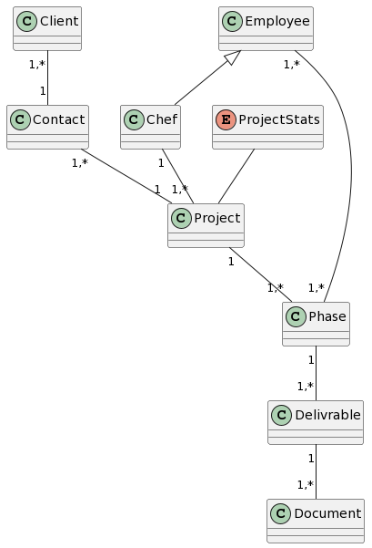
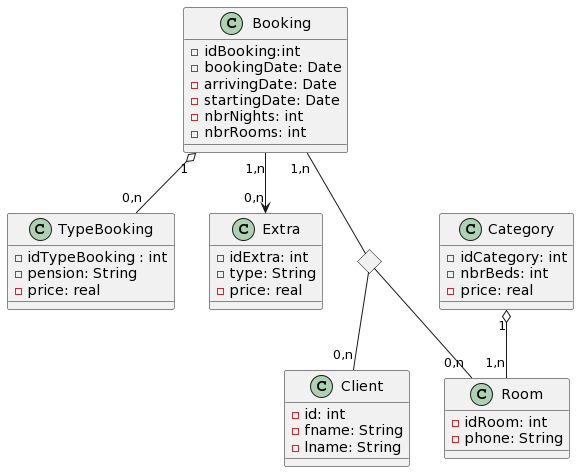
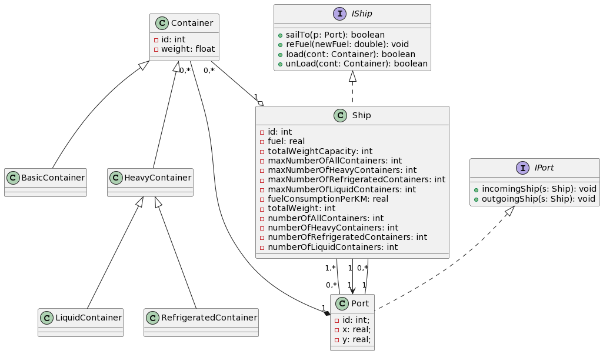

# UML CHALLENGES

***each challenge came with a class digram and it implementation expect the last***

## FROM CLASS DIGRAM TO CODE

you can see code [here](https://github.com/aymane-smi/uml-challenges/tree/master/challenge1)

## FROM ERD DIGRAM TO CLASS DIGRAM/CODE

ou can see code [here](https://github.com/aymane-smi/uml-challenges/tree/master/challenge2)

## REVERSE ENGINNER CODE TO CLASS DIGRAM

you can see code [here](https://github.com/arasgungore/CMPE160-projects/tree/main/ShipsAndPorts)

